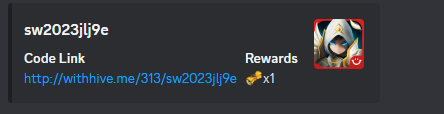
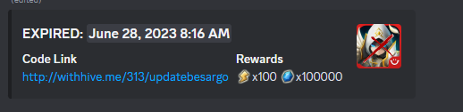

# SquidBot-cdk
<h3>CDK app to deploy infrastructure for automatically posting Summoners War codes to discord.</h3>

Uses Discord webhooks to post embeds with the reward info taken from https://swq.jp/l/en-US/. Embeds look like this 

There is a custom step in the process that verifies it is a legit code, so no troll or non-function codes!

Also will expire codes once they no longer become available to redeem, i.e, expired and invalid. After expiring the embed will show when it expired. Example: 


<h1>Infrastructure Info</h1>

The infrastructure for this application is hosted on AWS and uses the [AWS CDK](https://aws.amazon.com/cdk/) to deploy and update it programatically. 

Total costs for this app depends on how often the EventBridge event is set to trigger but can easily be less than $1 a month.

<!-- GETTING STARTED -->
## Getting Started

You can clone this repo and deploy this CDK app yourself, or create a webhook for your channel and message Tyshalle#4084 on discord to get added to an existing implementation.

### Prerequisites
* [Node.js](https://nodejs.org/en/download/) needs to be installed.
* An AWS Account.
* AWS SSM parameters to store the discord webhooks and used codes. You can change these references in the Lambda code under /lib/lambda/functions.
* AWS Credentials to deploy with CDK. Refer to [this guide.](https://docs.aws.amazon.com/cli/latest/userguide/cli-chap-getting-started.html)

### Installation steps

1. Install CDK: 
```sh
npm install -g aws-cdk
```
2. Clone the repository:
```sh
git clone https://github.com/sphayden/squidbot-cdk.git
```
3. CD into the directory the repository was cloned into.

4. Change the references to the SSM parameters for the used codes and the discord webhooks.

5. Bootstrap the CDK using your AWS Account information:
```sh
cdk bootstrap aws://ACCOUNT-NUMBER/REGION
```
6. Deploy the CDK App:
```sh
cdk deploy
```
7. Create webhook in your discord channel following [these instructions.](https://support.discord.com/hc/en-us/articles/228383668-Intro-to-Webhooks)

8. Add webhook to the SSM parameter as a list object. (i.e., ['webhook'])

9. Enjoy!