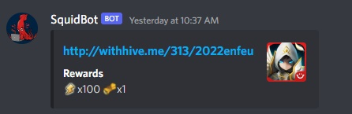

# SquidBot-cdk
<h3>CDK app to deploy infrastructure for automatically posting Summoners War codes to discord.</h3>

Uses Discord webhooks to post embeds with the reward info taken from https://swq.jp/l/en-US/. Embed look like this 


<h1>Infrastructure Info</h1>

The infrastructure for this application is hosted on AWS and uses the [AWS CDK](https://aws.amazon.com/cdk/) to deploy and update it programatically. 

Total costs for this app depends on how often the EventBridge event is set to trigger but can easily be less than $1 a month.

<!-- GETTING STARTED -->
## Getting Started

You can clone this repo and deploy this CDK app yourself, or 

### Prerequisites
* [Node.js](https://nodejs.org/en/download/) needs to be installed.
* AWS SSM parameters to store the discord webhooks and used codes. You can change these references in the Lambda code under /lib/lambda/functions

1. cdk
```sh
npm install aws-cdk-lib
```
2. Clone the repo
```sh
git clone https://github.com/sphayden/squidbot-cdk.git
```
3. CD into the directory the repository was cloned into.

4. Change the references to the SSM parameters for the used codes and the discord webhooks.